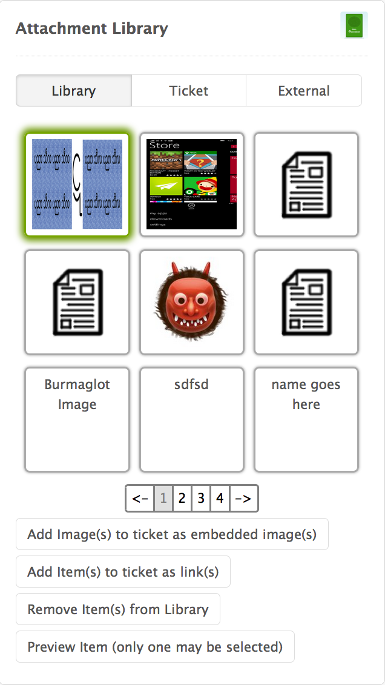
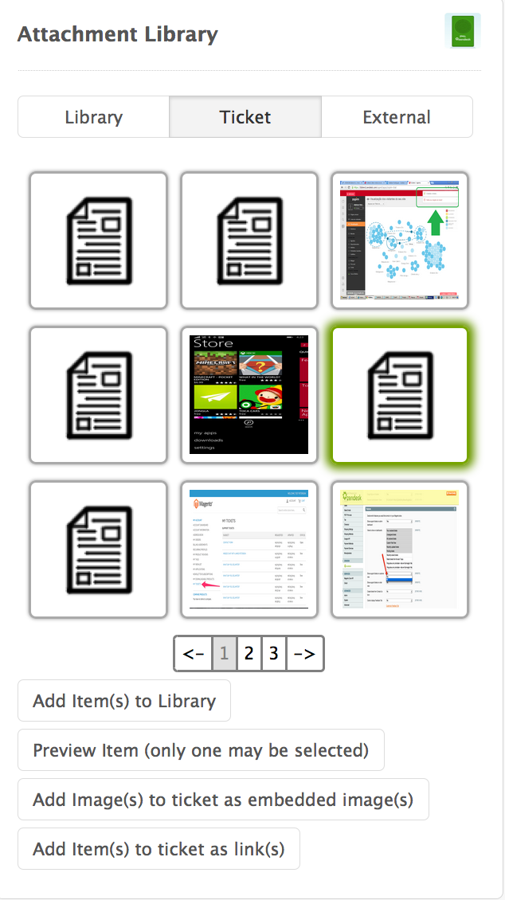
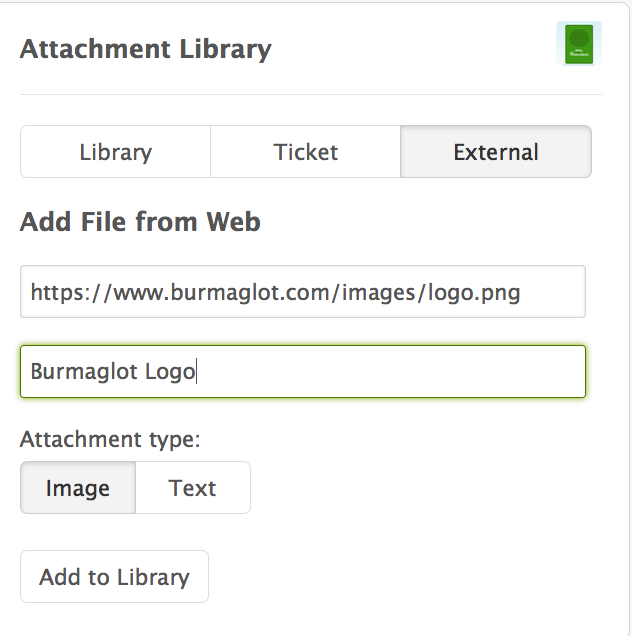

# Attachment Library App

This app will allow you to bookmark attachments from tickets or external URLs and embed them in tickets later.

### Screenshot(s):
Library tab - 

Ticket tab - 

External tab - 

### Set-up and Use

You must create a custom text user field that will store data about your bookmarks.  Grab the field key and enter it into the app when prompted during installation.  That's it for set up! 

Note: This app will not function properly if private attachments are enabled.  

The app is available on the ticket and new ticket pages.  Once you open a ticket, you can see the app in it's default state.  Click on one of the three buttons to see the app in action (Library, Ticket, External).

On the Library tab, you'll see any attachments that have already been added to your library.  You can select them to add to the ticket as an embedded image or plain link, preview them in a modal window, or remove them from your library.

On the Ticket tab, you'll see any attachments that have been added to the ticket.  You can select them to add to your library, preview them in a modal window, add them to the page as embedded images, or add plain links to them.

Note: if an attachment is added to the ticket after the ticket tab is loaded, you will need to click the ticket tab again to see the new attachment.

On the External tab, you'll be able to add attachments hosted outside of Zendesk to your library.  You'll just need to include the URL (https only), a name for the attachment, and the attachment type (image or text).

### Known issues and Bug Reports
Sometimes a broken image will appear instead of the thumbnail.  Please use the apps refresh button if that is the case.  We are working to address this issue.

Please submit bug reports to Us. Pull requests are welcome.